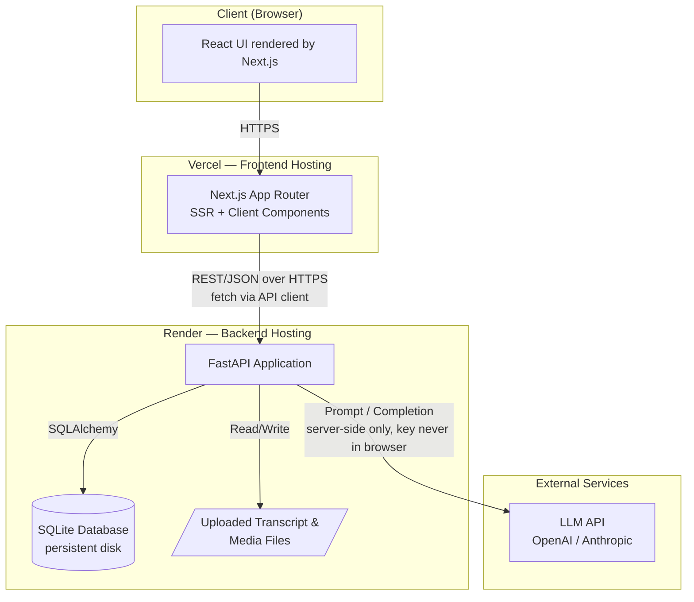
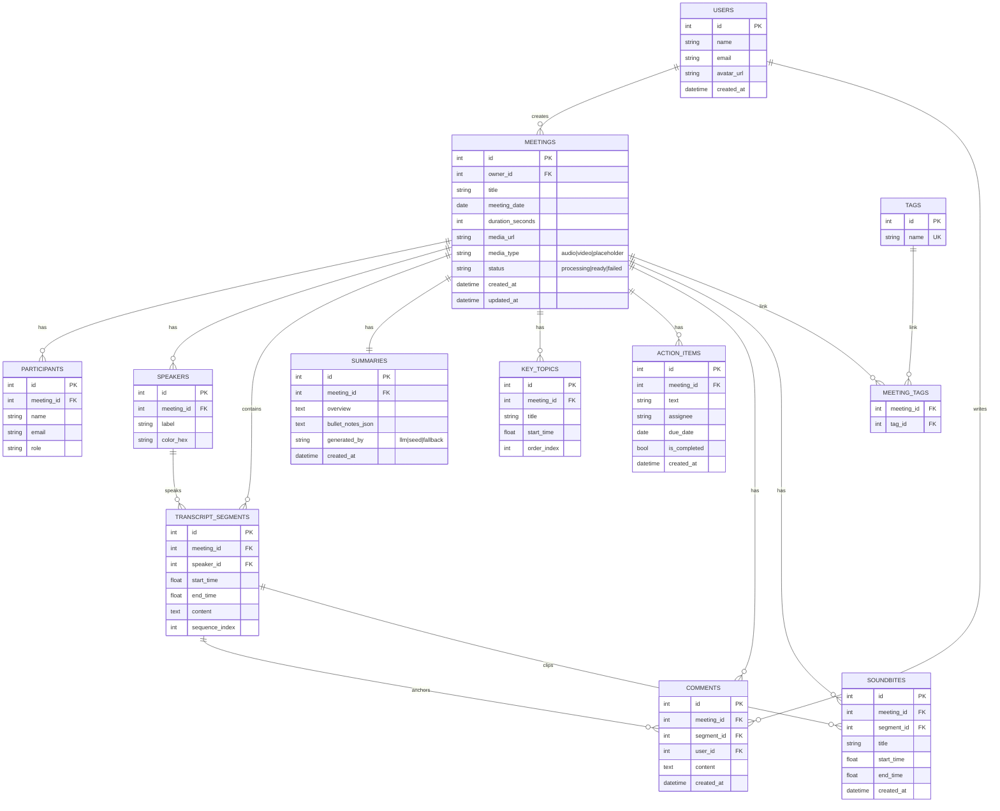
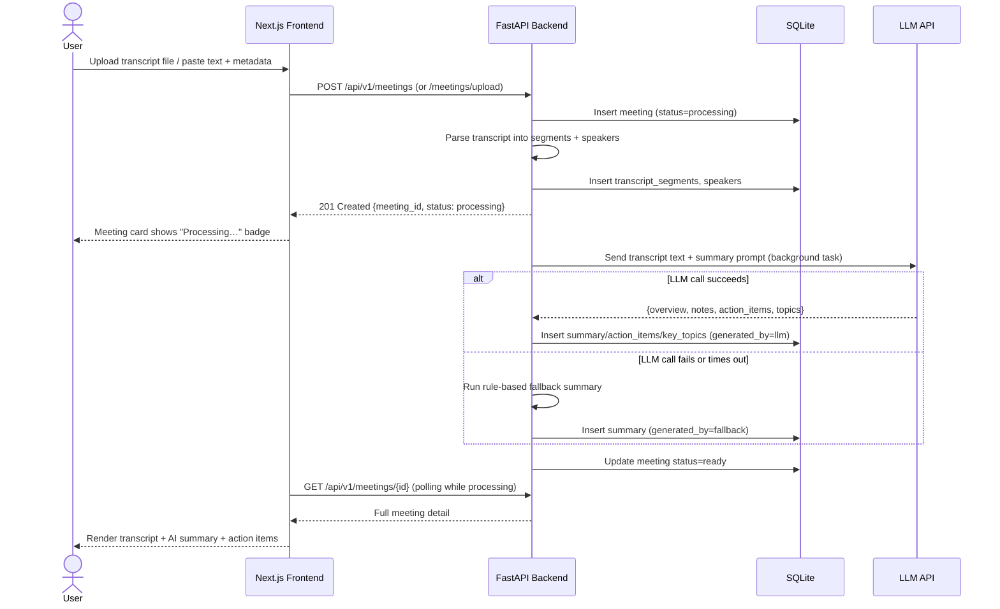
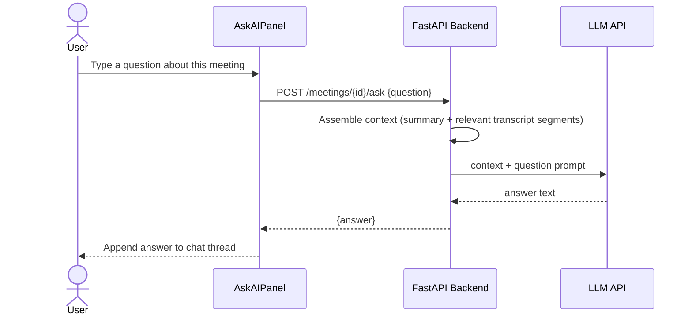

# Fireflies.ai Clone — Master Build Specification

**Project:** Meeting Notes & Transcription Platform (Fireflies.ai Clone)
**Purpose of this document:** This is the single source of truth for building the project. It is written to be handed directly to an AI coding agent (or a human engineer) to implement end-to-end. It covers architecture, database design, API design, frontend structure, UI/UX guidelines, workflows, and a phased build plan.

---

## 0. Instructions to the Building Agent

Read this document fully before writing any code. Then:

1. Follow the **Phased Build Plan (Section 11)** in order — each phase produces a working, demoable increment.
2. Do not invent scope beyond what's in this document without flagging it — but where a small implementation decision isn't specified (e.g. exact spacing, a helper function name), make a sensible choice and keep moving. Record any non-trivial assumption in the final README's "Assumptions" section instead of stopping to ask.
3. Treat **Section 6 (Database Schema)** and **Section 7 (API Design)** as contracts — the frontend and backend must agree on these exactly.
4. Every feature in **Section 5 (Feature Specification)** maps to an evaluation criterion in Section 12 — don't skip any "Must Have."
5. Write code as if a real engineer will review it: typed, modular, commented where non-obvious, no dead code, no TODO-and-abandon.
6. Produce the actual deliverables listed in **Section 13** at the end — including a project README distinct from this spec (this spec is the blueprint; the project README is the deliverable that ships with the repo).

---

## 1. Product Overview

A functional clone of Fireflies.ai's core post-meeting workflow: users browse a library of past meetings, open a meeting to see an interactive transcript synced to a media player, read an AI-generated summary (overview, bullet notes, action items, key topics), search across meetings and within a transcript, and manage everything through full CRUD. Real audio transcription is out of scope — transcripts are seeded, uploaded, or pasted; **AI summaries are generated for real via an LLM API call**, with seeded data as a fallback/demo baseline so the app is never empty or broken if the LLM call fails.

### Confirmed Stack Decisions
| Layer | Choice |
|---|---|
| Frontend | Next.js 14+ (TypeScript, App Router) |
| Styling | Tailwind CSS + shadcn/ui |
| Backend | Python, FastAPI |
| Database | SQLite (via SQLAlchemy ORM + Alembic migrations) |
| AI Summaries | Real LLM API call (OpenAI or Anthropic) on transcript create/upload, with a "Regenerate with AI" action; seeded summaries ship as fallback data |
| Deployment | Frontend → Vercel · Backend + SQLite → Render |
| Auth | None — a single default seeded user is treated as "logged in" everywhere |

---

## 2. High-Level Architecture (HLD)



**Key architectural decisions:**
- Frontend and backend are fully decoupled, communicating only via a versioned REST API (`/api/v1/...`). No server actions calling the DB directly — keeps the FastAPI layer as the single source of truth and testable in isolation.
- The LLM API key lives only in backend environment variables. The frontend never talks to the LLM directly.
- SQLite is used with a single Render persistent disk mounted for both the DB file and uploaded media/transcripts. This is acceptable for an assignment/demo scale; the README should note that a multi-instance production deployment would need Postgres + object storage (S3/R2) instead.
- Media playback: since real audio isn't required, uploaded/seeded meetings reference either (a) a placeholder sample audio file bundled in the repo, or (b) an uploaded audio/video file stored on the backend's file volume and served statically.

---

## 3. Low-Level Design — Backend

### 3.1 Backend Folder Structure

```
backend/
├── app/
│   ├── main.py                  # FastAPI app init, CORS, router registration
│   ├── core/
│   │   ├── config.py            # Pydantic Settings (env vars)
│   │   ├── db.py                # SQLAlchemy engine/session
│   │   └── logging.py
│   ├── models/                  # SQLAlchemy ORM models
│   │   ├── user.py
│   │   ├── meeting.py
│   │   ├── participant.py
│   │   ├── speaker.py
│   │   ├── transcript_segment.py
│   │   ├── summary.py
│   │   ├── key_topic.py
│   │   ├── action_item.py
│   │   ├── tag.py
│   │   ├── comment.py
│   │   └── soundbite.py
│   ├── schemas/                 # Pydantic request/response models (mirrors models/)
│   ├── routers/
│   │   ├── meetings.py
│   │   ├── transcripts.py
│   │   ├── summaries.py
│   │   ├── action_items.py
│   │   ├── tags.py
│   │   ├── comments.py
│   │   ├── soundbites.py
│   │   ├── search.py
│   │   ├── ask.py               # bonus: ask-AI-about-meeting chat
│   │   ├── export.py            # bonus: PDF/MD/TXT export
│   │   └── users.py
│   ├── services/
│   │   ├── llm_service.py       # wraps OpenAI/Anthropic call, prompt templates
│   │   ├── transcript_parser.py # parses .txt/.vtt/.json into segments
│   │   ├── search_service.py
│   │   └── export_service.py
│   └── seed/
│       ├── seed_data.py         # idempotent seeding script
│       └── transcripts/         # 5-6 sample transcript JSON/VTT files
├── alembic/                     # migrations
├── tests/                       # pytest — model + API tests
├── requirements.txt
├── Dockerfile
└── .env.example
```

### 3.2 Backend Conventions
- All routes live under `/api/v1`.
- Every request/response body is a typed Pydantic schema — no raw dicts in/out.
- Standard error envelope: `{"detail": "human readable message", "code": "MEETING_NOT_FOUND"}` with correct HTTP status codes (400/404/409/422/500).
- File uploads validated for type (`.txt`, `.vtt`, `.json`, `.mp3`, `.mp4`, `.wav`, `.m4a`) and size (cap at ~25MB for the assignment).
- LLM calls wrapped in try/except with a timeout; on failure, fall back to a lightweight rule-based summary (e.g., first N lines + naive keyword extraction) so the meeting never gets stuck in `processing` forever, and mark `summary.generated_by = "fallback"`.
- CORS restricted to the deployed frontend origin + localhost during dev.

---

## 4. Low-Level Design — Frontend

### 4.1 Frontend Folder Structure

```
frontend/
├── app/
│   ├── layout.tsx                 # root layout: navbar, theme provider, toaster
│   ├── page.tsx                   # redirects to /meetings
│   ├── meetings/
│   │   ├── page.tsx                # Meetings Library / Dashboard
│   │   ├── new/page.tsx            # Create meeting (upload/paste/form)
│   │   └── [id]/page.tsx           # Meeting Detail (transcript + AI panel)
│   ├── search/page.tsx             # bonus: global search results
│   └── settings/page.tsx           # placeholder
├── components/
│   ├── ui/                         # shadcn/ui generated primitives
│   ├── layout/
│   │   ├── Navbar.tsx
│   │   └── Sidebar.tsx
│   ├── meetings/
│   │   ├── MeetingCard.tsx
│   │   ├── MeetingList.tsx
│   │   ├── FilterBar.tsx
│   │   └── CreateMeetingModal.tsx
│   ├── transcript/
│   │   ├── TranscriptPanel.tsx
│   │   ├── TranscriptLine.tsx
│   │   ├── TranscriptSearchBar.tsx
│   │   └── MediaPlayer.tsx
│   ├── summary/
│   │   ├── SummaryPanel.tsx        # tabs: Overview / Notes / Action Items / Outline
│   │   ├── ActionItemList.tsx
│   │   ├── ActionItemRow.tsx
│   │   └── TopicsOutline.tsx
│   ├── ask/AskAIPanel.tsx          # bonus
│   └── common/{EmptyState,LoadingSkeleton,ConfirmDialog}.tsx
├── lib/
│   ├── api.ts                      # typed fetch client for the backend
│   ├── utils.ts
│   └── hooks/{useMeetings.ts,useMeetingDetail.ts,useDebounce.ts}
├── store/
│   └── playerStore.ts              # Zustand: currentTime, isPlaying, activeSegmentId, seekTo()
├── types/
│   └── index.ts                    # mirrors backend Pydantic schemas
├── public/media/sample-meeting.mp3 # bundled placeholder audio
├── next.config.ts
├── tailwind.config.ts
└── .env.example
```

### 4.2 State Management Approach
- **Server state** (meetings, transcripts, summaries, action items): TanStack Query — handles caching, refetch-on-mutation, and polling a meeting's `status` while it's `processing`.
- **Player state** (current playback time, active transcript segment, seek requests): a small Zustand store (`playerStore`) shared between `MediaPlayer` and `TranscriptPanel` so clicking a transcript line and dragging the seek bar stay in sync in both directions.
- **Everything else** (modals open/closed, active tab): local component state.

---

## 5. Feature Specification

Each feature below maps directly to the assignment's requirements.

### 5.1 Meetings Library / Dashboard (Must Have)
- Grid/list of `MeetingCard`s: title, formatted date, duration, participant avatar stack (overflow as "+N"), status badge (`processing` / `ready`), tag chips.
- `FilterBar`: text search (title), date range picker, participant filter (multi-select), sort by recency (default) or title.
- Debounced search (300ms) hitting `GET /api/v1/meetings` with query params — filtering happens server-side, not client-side, so it scales past the seed data.
- Empty state when no meetings match filters.
- Navbar: logo/wordmark, global search entry point, notifications bell (toast history — can be a simple dropdown of recent toasts), user avatar/profile menu (placeholder — "Profile" and "Settings" menu items, no real auth).

### 5.2 Meeting / Transcript Detail View (Must Have)
- Two-column layout on desktop: left = `TranscriptPanel` (scrollable, one row per segment: speaker avatar/initials with a consistent color, timestamp, text), right = `SummaryPanel` (tabbed: Overview / Notes / Action Items / Outline).
- `MediaPlayer` docked at the top of the transcript column (or sticky bottom on mobile): play/pause, seek bar, current/total time, playback speed selector (0.75x–2x — nice touch matching Fireflies).
- **Bidirectional sync:** clicking a transcript line seeks the player to `start_time` and plays; as the player advances, the transcript auto-highlights and auto-scrolls to the active segment. See sequence diagram in Section 9.2.
- `TranscriptSearchBar`: search within the open transcript, matches highlighted inline, with next/previous match navigation (like Cmd+F).

### 5.3 AI Summary & Notes (Must Have)
- **Overview**: 2–4 sentence AI-generated paragraph summarizing the meeting.
- **Notes**: bullet-point breakdown of what was discussed.
- **Action Items**: extracted as structured `{text, assignee, due_date?}` entries, editable after generation.
- **Key Topics / Outline**: an ordered list of topics/chapters, each optionally linked to a `start_time` so clicking a topic jumps the transcript/player there (mirrors Fireflies' chapter-style outline).
- Generation happens via `llm_service.py` when a meeting is created from an uploaded/pasted transcript (see Section 9.1 sequence diagram). A **"Regenerate with AI"** button lets the user re-run generation on demand.
- Seeded meetings ship with realistic pre-written summaries (`generated_by = "seed"`) so the app is fully populated without needing a live API key to demo.

### 5.4 Meeting Management — CRUD (Must Have)
- **Create**: `CreateMeetingModal` with two paths — (a) upload a `.txt`/`.vtt`/`.json` transcript file, or (b) paste raw transcript text — plus a metadata form (title, date, participants). On submit, meeting is created with `status = "processing"`, parsed into segments, and AI generation kicks off.
- **Edit**: inline-editable title and participant list from the meeting detail header.
- **Delete**: confirm dialog (`ConfirmDialog`) before cascading delete of transcript/summary/action items.
- **Action items**: add, edit text/assignee/due date, toggle complete, delete — directly from `ActionItemList`.
- Everything persists to SQLite — no in-memory-only state.

### 5.5 Fireflies-Grade Experience (Must Have)
- Toasts (via shadcn's `sonner`/`toast`) for every mutation: "Meeting created", "Action item completed", "Summary regenerated", errors surfaced clearly.
- Loading skeletons (not spinners) for meeting cards and transcript panel while data loads — matches the polish of the original.
- Settings page: placeholder sections for Notetaker, Integrations, Team — each a simple "Coming soon" card, per the assignment's mocked-sections list.

### 5.6 Bonus Features (build if time allows, in this priority order)
1. **Dark mode** — trivial with Tailwind + shadcn's theme provider; high visual payoff.
2. **Tags/topics with filtering** — `tags` + `meeting_tags` tables, chip UI, filter meetings by tag.
3. **Global search** — `/search` page hitting `GET /api/v1/search?q=` which searches meeting titles **and** transcript content, returning grouped results.
4. **Export** — `GET /api/v1/meetings/{id}/export?format=pdf|md|txt` for transcript+summary.
5. **Comments/soundbites** — pin a comment to a transcript segment; create a "soundbite" clip (`start_time`–`end_time` + title) shown as a small card under the transcript, matching Fireflies' soundbite concept.
6. **Ask-AI chat ("Ask Fred"-style)** — a chat panel scoped to one meeting; each question is answered by the LLM using that meeting's transcript + summary as context (Section 9.3).

---

## 6. Database Schema

### 6.1 Entity-Relationship Diagram



### 6.2 Notes on Design Choices
- `speakers` is separate from `participants`: participants are the real people invited to the meeting (used for filtering/display), while speakers are diarization labels attached to transcript segments (e.g. "Speaker 1" until renamed). A speaker can optionally be linked to a participant once identified — keep this as a nullable `participant_id` on `speakers` for a clean upgrade path, even if the UI doesn't expose relinking in v1.
- `summaries` is 1:1 with `meetings` — one row, `bullet_notes_json` stores the ordered list of note bullets as JSON text (SQLite has no native array type).
- `key_topics.start_time` is nullable — not every generated topic will map cleanly to a timestamp.
- Cascading deletes: deleting a meeting cascades to participants, speakers, transcript_segments, summary, key_topics, action_items, comments, soundbites, and meeting_tags rows (not the tags themselves).
- All timestamps are stored as floats in seconds (not `HH:MM:SS` strings) — formatting to display strings happens in the frontend.

---

## 7. API Design

Base path: `/api/v1`. All bodies are JSON except file upload (`multipart/form-data`).

### 7.1 Meetings
| Method | Path | Description |
|---|---|---|
| GET | `/meetings` | List meetings. Query params: `q`, `date_from`, `date_to`, `participant`, `tag`, `sort` (`recent`\|`title`), `page`, `page_size` |
| POST | `/meetings` | Create meeting via form fields (title, date, participants) + pasted transcript text |
| POST | `/meetings/upload` | Create meeting via multipart file upload (transcript/media) |
| GET | `/meetings/{id}` | Full meeting detail: metadata + participants + summary + topics (transcript fetched separately for pagination) |
| PATCH | `/meetings/{id}` | Edit title/date/participants |
| DELETE | `/meetings/{id}` | Delete meeting (cascades) |

### 7.2 Transcript
| Method | Path | Description |
|---|---|---|
| GET | `/meetings/{id}/transcript` | All segments, ordered by `sequence_index` |
| GET | `/meetings/{id}/transcript/search?q=` | Segments matching query, with match offsets for highlighting |

### 7.3 Summary
| Method | Path | Description |
|---|---|---|
| GET | `/meetings/{id}/summary` | Overview, notes, topics |
| POST | `/meetings/{id}/summary/regenerate` | Re-run LLM generation, overwrite existing summary/topics/action items (with confirmation on the frontend) |

### 7.4 Action Items
| Method | Path | Description |
|---|---|---|
| GET | `/meetings/{id}/action-items` | List |
| POST | `/meetings/{id}/action-items` | Create manually |
| PATCH | `/action-items/{item_id}` | Edit text/assignee/due_date/is_completed |
| DELETE | `/action-items/{item_id}` | Delete |

### 7.5 Tags (bonus)
| Method | Path | Description |
|---|---|---|
| GET | `/tags` | All tags |
| POST | `/meetings/{id}/tags` | Attach tag (creates tag if new) |
| DELETE | `/meetings/{id}/tags/{tag_id}` | Detach tag |

### 7.6 Comments & Soundbites (bonus)
| Method | Path | Description |
|---|---|---|
| GET | `/meetings/{id}/comments` | List comments |
| POST | `/meetings/{id}/comments` | Add comment, optional `segment_id` |
| GET | `/meetings/{id}/soundbites` | List soundbites |
| POST | `/meetings/{id}/soundbites` | Create clip `{segment_id, start_time, end_time, title}` |

### 7.7 Search (bonus)
| Method | Path | Description |
|---|---|---|
| GET | `/search?q=` | Cross-meeting search over titles + transcript content, grouped by meeting |

### 7.8 Ask AI (bonus)
| Method | Path | Description |
|---|---|---|
| POST | `/meetings/{id}/ask` | Body `{question}` → `{answer}`, answered from that meeting's transcript+summary context |

### 7.9 Export (bonus)
| Method | Path | Description |
|---|---|---|
| GET | `/meetings/{id}/export?format=pdf\|md\|txt` | Download transcript + summary in the requested format |

### 7.10 Users
| Method | Path | Description |
|---|---|---|
| GET | `/users/me` | Returns the single default seeded user |

---

## 8. UI/UX Design Guidelines (from Fireflies.ai analysis)

Fireflies' actual product structures the post-meeting experience around: a meetings list, a transcript view, and an **"AI Super Summary"** panel that breaks into keywords, a meeting overview paragraph, bullet-point notes, and action items — plus a side chat assistant ("Fred") that can answer questions about the meeting, and smart search/filtering by speaker and topic. Recreate that structure and feel:

- **Layout**: top navbar (logo, global search, notifications, avatar) + a left icon-sidebar for primary nav (Home/Meetings, Notetaker — placeholder, Analytics — placeholder, Integrations — placeholder, Settings). Main content area is the meetings grid or the two-column detail view.
- **Color palette**: clean white/very-light-gray background with a bold indigo/purple as the primary brand accent (buttons, active states, the play button, links) — this is the closest match to Fireflies' branding without claiming an exact proprietary hex value. Cards use soft shadows and generous rounded corners (`rounded-xl`/`rounded-2xl`).
- **Typography**: a clean sans-serif (Inter or the Next.js default font) — bold, larger titles for meeting names; muted gray for metadata (date, duration).
- **Speaker identity**: each speaker gets a consistent avatar-initial + color across the transcript, so scanning the panel visually separates who said what — same treatment used for participant avatar stacks on meeting cards.
- **Detail page tabs**: Overview / Notes / Action Items / Outline as a horizontal tab bar at the top of the right-hand `SummaryPanel`, mirroring the "AI Super Summary" breakdown.
- **Micro-interactions**: hover states on transcript lines (subtle background highlight before you even click), an actively-playing segment gets a persistent highlight + left accent bar, toasts slide in from the top-right and auto-dismiss.
- **Empty/loading states matter** — a `processing` meeting should show a clear "Generating summary…" state in the AI panel rather than a blank space.

---

## 9. Workflow Diagrams

### 9.1 Create Meeting → AI Summary Generation



### 9.2 Transcript ↔ Player Sync

```mermaid
sequenceDiagram
    actor U as User
    participant TL as TranscriptLine
    participant PS as playerStore (Zustand)
    participant MP as MediaPlayer

    U->>TL: Click transcript line (start_time = 120.5s)
    TL->>PS: seekTo(120.5)
    PS->>MP: currentTime updated via subscription
    MP->>MP: audio.currentTime = 120.5; play()
    MP->>PS: onTimeUpdate(currentTime) on every frame
    PS->>TL: activeSegmentId recomputed
    TL->>TL: Highlight active line + auto-scroll into view
```

### 9.3 Ask-AI Chat (bonus)



---

## 10. Non-Functional Requirements

- **Environment variables** (`.env.example` in both apps):
  - Backend: `DATABASE_URL`, `LLM_PROVIDER` (`openai`|`anthropic`), `OPENAI_API_KEY` / `ANTHROPIC_API_KEY`, `LLM_MODEL`, `CORS_ORIGINS`, `MEDIA_STORAGE_PATH`, `MAX_UPLOAD_MB`.
  - Frontend: `NEXT_PUBLIC_API_BASE_URL`.
- **Validation**: every input validated with Pydantic on the backend (don't trust the frontend); file type/size checked before parsing.
- **Error handling**: consistent JSON error envelope; frontend shows toast + inline error state, never a silent failure or a raw stack trace.
- **Performance**: paginate the meetings list (`page`/`page_size`) and transcript segments for long meetings; debounce all search inputs.
- **Security**: sanitize any transcript text before rendering (React escapes by default — avoid `dangerouslySetInnerHTML` except where highlighting matches, and sanitize there); LLM API keys never exposed to the client; CORS locked to known origins in production.
- **Testing**: backend — pytest covering model CRUD and the main API routes (meetings, action items, transcript search) with a test SQLite DB; frontend — at minimum type-checked with no `any` leakage in API contracts; component tests are a nice-to-have, not required for the assignment timeline.

---

## 11. Phased Build Plan

Build and demo-check at the end of each phase before moving to the next.

1. **Scaffolding** — monorepo with `frontend/` and `backend/`; root README stub; backend `Dockerfile`; Next.js + Tailwind + shadcn/ui installed.
2. **Backend foundations** — SQLAlchemy models, Alembic initial migration, seed script (5–6 full meetings with transcripts/speakers/summaries/action items/topics/tags across varied meeting types — e.g. sales call, sprint standup, 1:1, hiring interview, all-hands), core meetings CRUD endpoints.
3. **Frontend foundations** — layout/navbar/sidebar, meetings library page wired to `GET /meetings`, `MeetingCard`, `FilterBar`.
4. **Meeting detail core** — transcript panel + `MediaPlayer` + bidirectional timestamp sync (Section 9.2).
5. **AI summary pipeline** — `llm_service.py`, generation on create, `SummaryPanel` tabs, "Regenerate with AI".
6. **Full CRUD** — create meeting modal (upload + paste + form), edit/delete meeting, action item CRUD.
7. **Search & filters** — library filters, in-transcript search with highlighting, global search page.
8. **Bonus features** — dark mode → tags → export → comments/soundbites → Ask-AI chat, in that priority order if time is limited.
9. **Polish** — toasts on every mutation, loading skeletons, empty states, responsive layout, settings placeholder page.
10. **Deployment** — Render (backend + SQLite volume + env vars), Vercel (frontend + `NEXT_PUBLIC_API_BASE_URL`), verify seed data loads on first boot.
11. **Documentation** — write the project README (Section 13), do a final pass against Section 12's evaluation criteria.

---

## 12. Evaluation Criteria Mapping

| Criteria | Where it's addressed |
|---|---|
| Functionality | Sections 5, 7, 9 — every Must-Have feature specified with exact API contracts |
| UI/UX | Section 8 — Fireflies-derived layout, color, and interaction guidelines |
| Database Design | Section 6 — normalized schema with clear FK relationships and rationale |
| Backend/API Design | Section 7 — versioned REST API, typed schemas, consistent error handling |
| Code Quality | Section 3.2, Section 10 — conventions, validation, error handling |
| Code Modularity | Sections 3.1, 4.1 — routers/services split, component-per-concern frontend structure |
| Code Understanding | Every design decision here has a stated rationale so it can be explained in the evaluation interview |

---

## 13. Final Deliverables Checklist

- [ ] Public GitHub repo with `frontend/` and `backend/`
- [ ] Project README (separate from this spec) containing: setup instructions, tech stack, architecture overview, database schema, API overview, and an **Assumptions** section
- [ ] Seed data loaded (5–6 realistic full meetings)
- [ ] Deployed frontend (Vercel) + backend (Render) links, both working end-to-end
- [ ] All Must-Have features functional; bonus features implemented per Section 5.6 priority as time allows

---

## 14. Assumptions Baked Into This Spec

- No real authentication — a single seeded default user stands in for "logged in."
- Real-time bot joining live calls, actual speech-to-text, and third-party integrations remain "Coming soon" placeholders per the assignment.
- LLM generation runs server-side synchronously-enough for assignment scale (single background task per upload); a production system at scale would need a proper task queue (Celery/RQ), which is out of scope here but worth a one-line callout in the README.
- SQLite + local file storage is acceptable for this assignment's single-instance deployment; noted as a scaling limitation rather than solved for.
