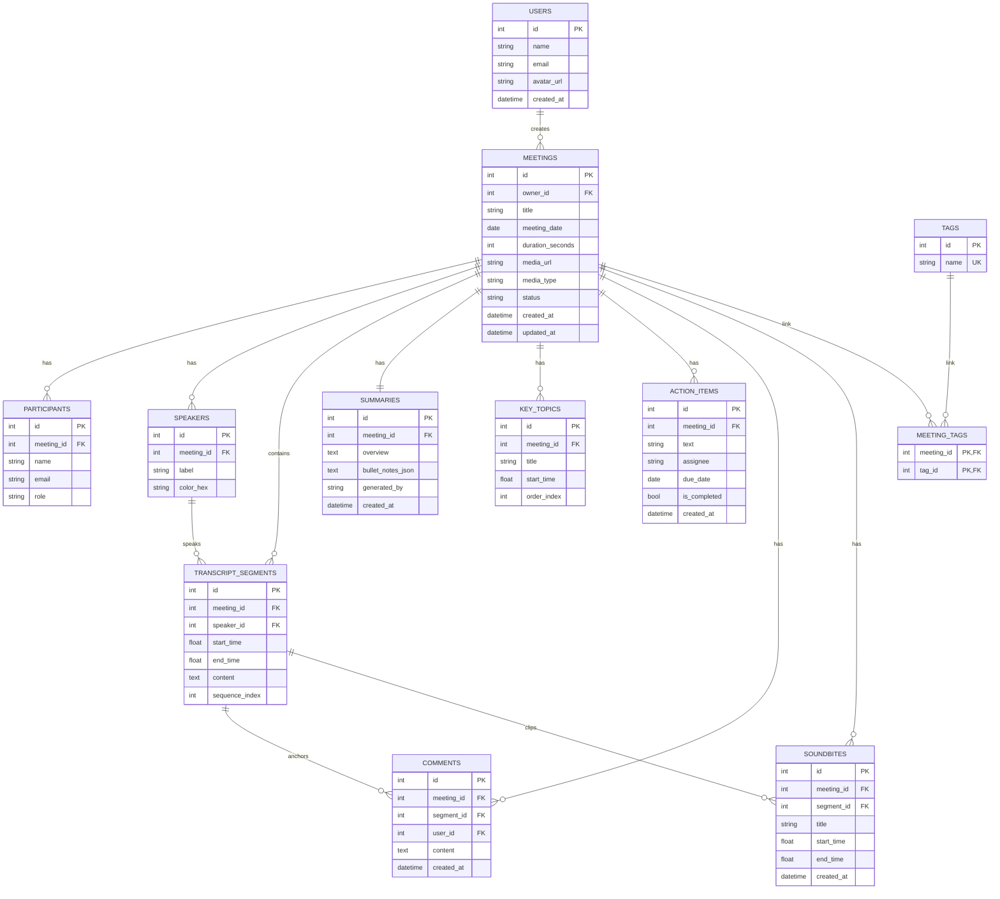

# 🎙️ Fireflies.ai Clone — Meeting Notes & Transcription Platform

A fullstack meeting-assistant web application replicating the design, user experience, and core post-meeting workflows of **Fireflies.ai**. Built with **Next.js 14+ (TypeScript)**, **FastAPI (Python)**, **SQLAlchemy ORM**, and **SQLite**.

---

## 🌟 Features Overview

### 1. 📋 Meetings Library & Dashboard
- **Library Grid & List View**: Displays past meetings with title, formatted date, duration, diarized participant avatar stacks (with overflow indicators), and AI processing status badges (`ready` / `processing`).
- **Real-Time Filtering & Debounced Search**: Server-side search by title/content, date range pickers (`from` / `to`), participant name filter, and tag chips.
- **Sorting**: Instant switching between recency and alphabetical sort orders.
- **1-Click Meeting Creation**: Create meetings via transcript file upload (`.txt`, `.vtt`, `.json`), raw text pasting, or pre-configured **Demo Presets**.

### 2. 🎧 Interactive Meeting Detail & Media Player
- **Bidirectional Player ↔ Transcript Sync**:
  - Clicking any transcript segment immediately seeks the audio player to that exact timestamp and starts playback.
  - As the audio plays, the active transcript segment dynamically highlights and smoothly auto-scrolls into view.
- **Full Media Player**: Play/pause, seek progress slider, -5s rewind / +5s forward skip buttons, variable playback speeds (0.5x, 0.75x, 1x, 1.25x, 1.5x, 2x), and volume/mute controls.
- **In-Transcript Search**: Live within-transcript search highlighting matches in real-time with match counters and next/previous match jump navigation.
- **Speaker Diarization**: Distinct avatar badges and consistent color mapping for all meeting speakers.
- **Micro-Interactions**: Hover actions on transcript lines to pin comments or create soundbite audio clips.

### 3. ✨ AI Super Summary & Notes
- **Executive Overview**: 2–4 sentence high-level executive summary paragraph with AI generation method attribution (`llm`, `seed`, `fallback`).
- **Key Discussion Notes**: Structured bullet-point breakdown of all main topics and decisions discussed.
- **Action Items & Task Tracker**: Structured tasks with assignees and due dates. Support for marking tasks complete, inline editing, manual creation, and deletion.
- **Interactive Chapter Outline**: Chronological topic breakdown with clickable timestamp chips that jump player and transcript directly to each section.
- **Regenerate with AI**: On-demand re-execution of the LLM summarization pipeline with confirmation modal.
- **🤖 Ask Fred AI Assistant**: Interactive meeting-scoped chat assistant answering queries about decisions, action items, and discussion points using transcript context.

### 4. 🚀 Meeting Management (Full CRUD)
- **Create**: Multipart file upload or JSON payload with automatic segment parsing and AI summary generation.
- **Edit**: Inline editable title and tag management.
- **Delete**: Cascading deletion with confirmation modal dialogs.
- **Export**: Instant downloads of meeting transcripts, summaries, and action items in **Markdown (`.md`)** and **Plain Text (`.txt`)** formats.

### 5. 🎨 Polished Fireflies UI/UX
- Fireflies-grade indigo/purple aesthetic, soft cards, responsive two-column layout.
- **Dark Mode & Light Mode**: Built-in seamless theme switching with system detection.
- **Skeleton Loaders & Empty States**: Polished loading skeletons and contextual empty states.
- **Toasts**: Non-intrusive toast notifications for every user action via Sonner.
- **Placeholder Pages**: Polished "Coming Soon" sections for Notetaker Bots, Integrations, and Team Collaboration.

---

## 🛠️ Tech Stack

| Layer | Technology | Rationale |
|---|---|---|
| **Frontend** | **Next.js 14+ (App Router, TypeScript)** | Modern React framework with server-side rendering, fast routing, and type safety |
| **Styling** | **Tailwind CSS + Vanilla CSS Tokens** | Custom Fireflies-matched color palette, dark mode variables, and micro-animations |
| **State Management** | **TanStack Query + Zustand** | React Query for server cache synchronization; Zustand for player ↔ transcript bidirectional sync |
| **Backend** | **Python, FastAPI** | High-performance async Python framework with automatic OpenAPI docs and dependency injection |
| **ORM & DB** | **SQLAlchemy 2.0 + SQLite + Alembic** | Robust relational ORM with cascading relationships, migrations, and persistent storage |
| **AI Summaries** | **OpenAI / Anthropic + Heuristic Fallback** | Multi-provider LLM integration with an automated keyword/sentence extraction fallback |
| **Icons & UI** | **Lucide React + Radix UI + Sonner** | Accessible UI primitives and interactive feedback |

---

## 🏗️ Architecture

```
┌─────────────────────────────────────────────────────────────┐
│                      Client Browser                         │
│   Next.js App Router UI (React, Tailwind CSS, Zustand)      │
└──────────────────────────────┬──────────────────────────────┘
                               │ REST API / JSON over HTTPS
                               ▼
┌─────────────────────────────────────────────────────────────┐
│                 FastAPI Application Server                  │
│  ├── Routers (/api/v1/meetings, /transcripts, /summaries)   │
│  ├── Services (llm_service, transcript_parser, export)      │
│  └── SQLAlchemy 2.0 ORM Layer                               │
└──────────────┬──────────────────────────────┬───────────────┘
               │                              │
               ▼                              ▼
┌──────────────────────────────┐ ┌────────────────────────────┐
│      SQLite Database         │ │     External LLM API       │
│  (Users, Meetings, Segments, │ │    (OpenAI / Anthropic     │
│   Summaries, Action Items)   │ │  with Fallback Summarizer) │
└──────────────────────────────┘ └────────────────────────────┘
```

---

## 🗄️ Database Schema



---

## 📡 API Overview (`/api/v1`)

| Method | Endpoint | Description |
|---|---|---|
| `GET` | `/meetings` | List meetings with search (`q`), date range, participant, tag filters, sorting, and pagination |
| `POST` | `/meetings` | Create meeting from form metadata and pasted transcript text |
| `POST` | `/meetings/upload` | Create meeting via multipart file upload (`.txt`, `.vtt`, `.json`, `.mp3`) |
| `GET` | `/meetings/{id}` | Full meeting detail (participants, tags, speakers, summary, topics, action items) |
| `PATCH` | `/meetings/{id}` | Update title, meeting date, or participants |
| `DELETE` | `/meetings/{id}` | Cascading deletion of meeting and all associated data |
| `GET` | `/meetings/{id}/transcript` | Get diarized transcript segments in chronological order |
| `GET` | `/meetings/{id}/transcript/search?q=` | Search in-transcript with match character offsets for highlighting |
| `GET` | `/meetings/{id}/summary` | Retrieve overview, bullet notes, and key topics |
| `POST` | `/meetings/{id}/summary/regenerate` | Re-run AI summarization on the transcript |
| `GET` | `/meetings/{id}/action-items` | List action items for a meeting |
| `POST` | `/meetings/{id}/action-items` | Manually create a new action item |
| `PATCH` | `/action-items/{id}` | Update task text, assignee, due date, or `is_completed` |
| `DELETE` | `/action-items/{id}` | Delete an action item |
| `GET` | `/tags` | List all existing tags |
| `POST` | `/meetings/{id}/tags` | Attach a tag to a meeting |
| `DELETE` | `/meetings/{id}/tags/{tag_id}` | Detach tag from a meeting |
| `GET` | `/meetings/{id}/comments` | List comments on a meeting or transcript segments |
| `POST` | `/meetings/{id}/comments` | Pin a comment to a transcript segment |
| `GET` | `/meetings/{id}/soundbites` | List audio soundbite clips |
| `POST` | `/meetings/{id}/soundbites` | Create a soundbite clip with start/end timestamps |
| `GET` | `/search?q=` | Global cross-meeting search over titles and transcript text |
| `POST` | `/meetings/{id}/ask` | "Ask Fred" conversational AI assistant Q&A |
| `GET` | `/meetings/{id}/export?format=md\|txt` | Download transcript and summary in Markdown or Text format |
| `GET` | `/users/me` | Current user profile |

---

## 🚀 Quickstart & Local Setup

### Prerequisites
- **Node.js** v18+ and **npm**
- **Python** 3.10+ and **pip**

### 1. Backend Setup

```bash
cd backend

# Create and activate virtual environment (optional)
python -m venv venv
# On Windows:
venv\Scripts\activate
# On macOS/Linux:
source venv/bin/activate

# Install dependencies
pip install -r requirements.txt

# Create .env from example (optional for LLM keys)
cp .env.example .env

# Run FastAPI backend server (auto-seeds 6 realistic meetings on startup)
uvicorn app.main:app --reload --port 8000
```
Backend API will be live at `http://localhost:8000`. Interactive OpenAPI documentation available at `http://localhost:8000/docs`.

### 2. Frontend Setup

```bash
cd frontend

# Install dependencies
npm install

# Start Next.js development server
npm run dev
```
Frontend application will be live at `http://localhost:3000`.

---

## 🧪 Running Tests

### Backend Test Suite (pytest)
```bash
cd backend
python -m pytest tests/ -v
```
*Executes 14 unit and integration tests with an in-memory SQLite database covering meetings CRUD, transcript parsing, action items, search, and Ask AI.*

### Frontend Verification
```bash
cd frontend
npm run build
npx prettier --check .
```

---

## 💡 Assumptions & Design Decisions

1. **Authentication**: In accordance with the assignment brief, a single default user (`Anurag Basuri`) is treated as logged in across the workspace.
2. **Speech-to-Text**: Real-time live audio transcription is out of scope. Transcripts are seeded, uploaded, or pasted, and then parsed into diarized segments with timestamps.
3. **AI Fallback Mechanism**: If no OpenAI or Anthropic API key is provided, the backend seamlessly falls back to a deterministic rule-based summarization engine that extracts overviews, bullet points, action items, and topic chapters. The platform is never broken or empty without an API key.
4. **Media Playback**: Meetings reference bundled placeholder audio files (`/media/sample-meeting.mp3`) with valid audio headers for HTML5 playback, seeking, and bidirectional sync demonstration.
5. **Database**: SQLite with persistent disk storage is utilized for ease of evaluation and deployment portability. In a multi-instance production environment, PostgreSQL and object storage (e.g. AWS S3) would be substituted.