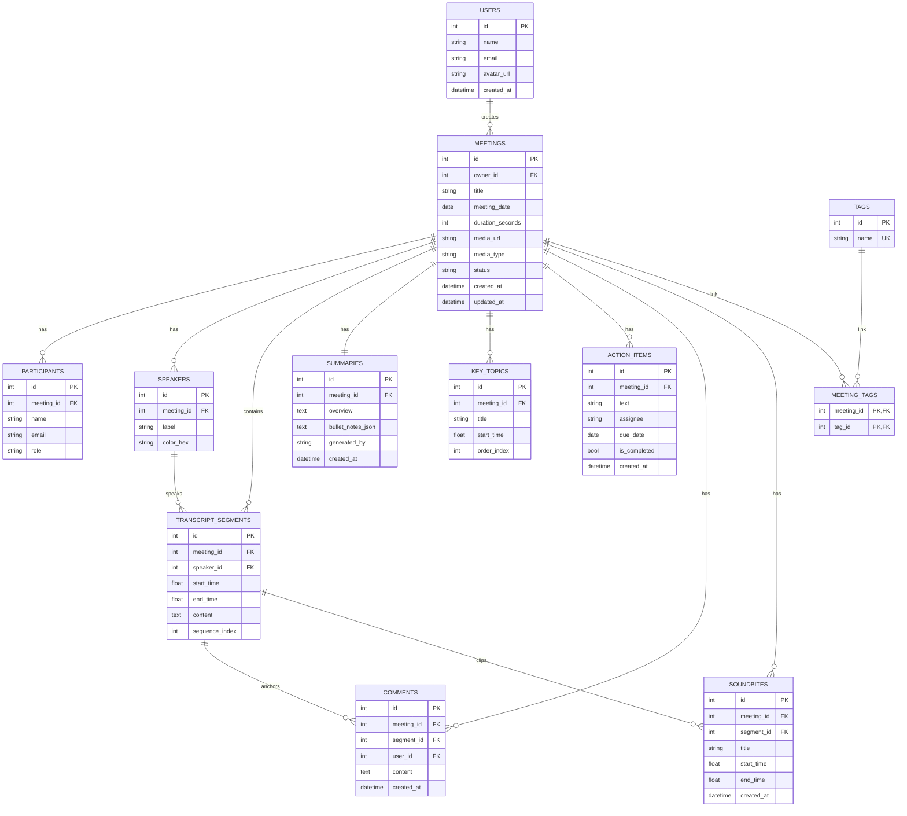

# 🎙️ Fireflies.ai Clone — Meeting Notes & Transcription Platform

A fullstack meeting-assistant web application replicating the design, user experience, and core post-meeting workflows of **Fireflies.ai**. Built with **Next.js 14+ (TypeScript)**, **FastAPI (Python)**, **SQLAlchemy ORM**, and **SQLite**.

---

## 🌟 Features Overview

### 1. 📋 Meetings Library & Dashboard
- **Library Grid & List View**: Displays past meetings with title, formatted date, duration, diarized participant avatar stacks (with overflow indicators), and AI processing status badges (`ready` / `processing`).
- **Real-Time Filtering & Debounced Search**: Server-side search by title/content, date range pickers (`from` / `to`), participant name filter, and tag chips.
- **Sorting**: Instant switching between recency and alphabetical sort orders.
- **1-Click Meeting Creation**: Create meetings via transcript file upload (`.txt`, `.vtt`, `.json`), raw text pasting, or pre-configured **Demo Presets**.

### 2. 🎧 Interactive Meeting Detail & Media Player
- **Bidirectional Player ↔ Transcript Sync**:
  - Clicking any transcript segment immediately seeks the audio player to that exact timestamp and starts playback.
  - As the audio plays, the active transcript segment dynamically highlights and smoothly auto-scrolls into view.
- **Full Media Player**: Play/pause, seek progress slider, -5s rewind / +5s forward skip buttons, variable playback speeds (0.5x, 0.75x, 1x, 1.25x, 1.5x, 2x), and volume/mute controls.
- **In-Transcript Search**: Live within-transcript search highlighting matches in real-time with match counters and next/previous match jump navigation.
- **Speaker Diarization**: Distinct avatar badges and consistent color mapping for all meeting speakers.
- **Micro-Interactions**: Hover actions on transcript lines to pin comments or create soundbite audio clips.

### 3. ✨ AI Super Summary & Notes
- **Executive Overview**: 2–4 sentence high-level executive summary paragraph with AI generation method attribution (`llm`, `seed`, `fallback`).
- **Key Discussion Notes**: Structured bullet-point breakdown of all main topics and decisions discussed.
- **Action Items & Task Tracker**: Structured tasks with assignees and due dates. Support for marking tasks complete, inline editing, manual creation, and deletion.
- **Interactive Chapter Outline**: Chronological topic breakdown with clickable timestamp chips that jump player and transcript directly to each section.
- **Regenerate with AI**: On-demand re-execution of the LLM summarization pipeline with confirmation modal.
- **🤖 Ask Fred AI Assistant**: Interactive meeting-scoped chat assistant answering queries about decisions, action items, and discussion points using transcript context.

### 4. 🚀 Meeting Management (Full CRUD)
- **Create**: Multipart file upload or JSON payload with automatic segment parsing and AI summary generation.
- **Edit**: Inline editable title and tag management.
- **Delete**: Cascading deletion with confirmation modal dialogs.
- **Export**: Instant downloads of meeting transcripts, summaries, and action items in **Markdown (`.md`)** and **Plain Text (`.txt`)** formats.

### 5. 🎨 Polished Fireflies UI/UX
- Fireflies-grade indigo/purple aesthetic, soft cards, responsive two-column layout.
- **Dark Mode & Light Mode**: Built-in seamless theme switching with system detection.
- **Skeleton Loaders & Empty States**: Polished loading skeletons and contextual empty states.
- **Toasts**: Non-intrusive toast notifications for every user action via Sonner.
- **Placeholder Pages**: Polished "Coming Soon" sections for Notetaker Bots, Integrations, and Team Collaboration.

---

## 🛠️ Tech Stack

| Layer | Technology | Rationale |
|---|---|---|
| **Frontend** | **Next.js 14+ (App Router, TypeScript)** | Modern React framework with server-side rendering, fast routing, and type safety |
| **Styling** | **Tailwind CSS + Vanilla CSS Tokens** | Custom Fireflies-matched color palette, dark mode variables, and micro-animations |
| **State Management** | **TanStack Query + Zustand** | React Query for server cache synchronization; Zustand for player ↔ transcript bidirectional sync |
| **Backend** | **Python, FastAPI** | High-performance async Python framework with automatic OpenAPI docs and dependency injection |
| **ORM & DB** | **SQLAlchemy 2.0 + SQLite + Alembic** | Robust relational ORM with cascading relationships, migrations, and persistent storage |
| **AI Summaries** | **OpenAI / Anthropic + Heuristic Fallback** | Multi-provider LLM integration with an automated keyword/sentence extraction fallback |
| **Icons & UI** | **Lucide React + Radix UI + Sonner** | Accessible UI primitives and interactive feedback |

---

## 🏗️ Architecture

```
┌─────────────────────────────────────────────────────────────┐
│                      Client Browser                         │
│   Next.js App Router UI (React, Tailwind CSS, Zustand)      │
└──────────────────────────────┬──────────────────────────────┘
                               │ REST API / JSON over HTTPS
                               ▼
┌─────────────────────────────────────────────────────────────┐
│                 FastAPI Application Server                  │
│  ├── Routers (/api/v1/meetings, /transcripts, /summaries)   │
│  ├── Services (llm_service, transcript_parser, export)      │
│  └── SQLAlchemy 2.0 ORM Layer                               │
└──────────────┬──────────────────────────────┬───────────────┘
               │                              │
               ▼                              ▼
┌──────────────────────────────┐ ┌────────────────────────────┐
│      SQLite Database         │ │     External LLM API       │
│  (Users, Meetings, Segments, │ │    (OpenAI / Anthropic     │
│   Summaries, Action Items)   │ │  with Fallback Summarizer) │
└──────────────────────────────┘ └────────────────────────────┘
```

---

## 🗄️ Database Schema



---

## 📡 API Overview (`/api/v1`)

| Method | Endpoint | Description |
|---|---|---|
| `GET` | `/meetings` | List meetings with search (`q`), date range, participant, tag filters, sorting, and pagination |
| `POST` | `/meetings` | Create meeting from form metadata and pasted transcript text |
| `POST` | `/meetings/upload` | Create meeting via multipart file upload (`.txt`, `.vtt`, `.json`, `.mp3`) |
| `GET` | `/meetings/{id}` | Full meeting detail (participants, tags, speakers, summary, topics, action items) |
| `PATCH` | `/meetings/{id}` | Update title, meeting date, or participants |
| `DELETE` | `/meetings/{id}` | Cascading deletion of meeting and all associated data |
| `GET` | `/meetings/{id}/transcript` | Get diarized transcript segments in chronological order |
| `GET` | `/meetings/{id}/transcript/search?q=` | Search in-transcript with match character offsets for highlighting |
| `GET` | `/meetings/{id}/summary` | Retrieve overview, bullet notes, and key topics |
| `POST` | `/meetings/{id}/summary/regenerate` | Re-run AI summarization on the transcript |
| `GET` | `/meetings/{id}/action-items` | List action items for a meeting |
| `POST` | `/meetings/{id}/action-items` | Manually create a new action item |
| `PATCH` | `/action-items/{id}` | Update task text, assignee, due date, or `is_completed` |
| `DELETE` | `/action-items/{id}` | Delete an action item |
| `GET` | `/tags` | List all existing tags |
| `POST` | `/meetings/{id}/tags` | Attach a tag to a meeting |
| `DELETE` | `/meetings/{id}/tags/{tag_id}` | Detach tag from a meeting |
| `GET` | `/meetings/{id}/comments` | List comments on a meeting or transcript segments |
| `POST` | `/meetings/{id}/comments` | Pin a comment to a transcript segment |
| `GET` | `/meetings/{id}/soundbites` | List audio soundbite clips |
| `POST` | `/meetings/{id}/soundbites` | Create a soundbite clip with start/end timestamps |
| `GET` | `/search?q=` | Global cross-meeting search over titles and transcript text |
| `POST` | `/meetings/{id}/ask` | "Ask Fred" conversational AI assistant Q&A |
| `GET` | `/meetings/{id}/export?format=md\|txt` | Download transcript and summary in Markdown or Text format |
| `GET` | `/users/me` | Current user profile |

---

## 🚀 Quickstart & Local Setup

### Prerequisites
- **Node.js** v18+ and **npm**
- **Python** 3.10+ and **pip**

### 1. Backend Setup

```bash
cd backend

# Create and activate virtual environment (optional)
python -m venv venv
# On Windows:
venv\Scripts\activate
# On macOS/Linux:
source venv/bin/activate

# Install dependencies
pip install -r requirements.txt

# Create .env from example (optional for LLM keys)
cp .env.example .env

# Run FastAPI backend server (auto-seeds 6 realistic meetings on startup)
uvicorn app.main:app --reload --port 8000
```
Backend API will be live at `http://localhost:8000`. Interactive OpenAPI documentation available at `http://localhost:8000/docs`.

### 2. Frontend Setup

```bash
cd frontend

# Install dependencies
npm install

# Start Next.js development server
npm run dev
```
Frontend application will be live at `http://localhost:3000`.

---

## 🧪 Running Tests

### Backend Test Suite (pytest)
```bash
cd backend
python -m pytest tests/ -v
```
*Executes 14 unit and integration tests with an in-memory SQLite database covering meetings CRUD, transcript parsing, action items, search, and Ask AI.*

### Frontend Verification
```bash
cd frontend
npm run build
npx prettier --check .
```

---

## 💡 Assumptions Made During Development

### 1. User Authentication and Identity Management
In accordance with the assignment guidelines, full multi-user authentication (e.g., JWT, OAuth 2.0, session cookies) is considered out of scope. The application operates under the assumption of a single authenticated workspace user (`Anurag Basuri`, `User ID: 1`). All created meetings, uploaded transcripts, comments, and task modifications are automatically attributed to this default session. This architectural decision avoids unnecessary authentication boilerplate while maintaining a normalized database schema with foreign key relationships that can seamlessly accommodate a multi-tenant authentication provider in a future production release.

### 2. Speech-to-Text (STT) and Transcript Ingestion
Real-time audio transcription via automatic speech recognition (ASR) engines (e.g., Whisper, Deepgram) is treated as an external upstream service rather than an in-app feature. Instead, the platform focuses on post-meeting workflows by ingesting pre-transcribed text through structured file uploads (`.vtt`, `.json`, `.txt`), direct text pasting, or seeded database records. The backend parser extracts speaker diarization tokens, converts timestamp markers into floating-point seconds, and normalizes the spoken content into structured transcript segments.

### 3. Media Playback and Audio Synchronization
To demonstrate HTML5 media seeking and bidirectional timestamp synchronization without requiring multi-gigabyte media storage, the application links meetings to a lightweight placeholder audio file (`sample-meeting.mp3`) with valid headers. The custom media player and interactive transcript communicate through a centralized reactive state store, enabling real-time audio scrubbing, playback speed adjustments (0.5x to 2.0x), active speaker highlighting, and automatic transcript scrolling to the exact second of playback.

### 4. Database Architecture and Single-Instance Deployment
For portability, local reproducibility, and zero-configuration review, SQLite was chosen as the primary relational database, managed through SQLAlchemy 2.0 ORM and Alembic schema migrations. While SQLite with persistent disk storage is optimal for single-instance evaluation and lightweight hosting, the codebase adheres strictly to standard relational modeling practices (foreign keys, cascading deletes, unique constraints). In an enterprise horizontal-scaling environment, the database engine can be transitioned to PostgreSQL with object storage (AWS S3 or Cloudflare R2) simply by updating environment configurations.

### 5. Dual-Engine AI Summaries and System Resilience
The AI summarization pipeline is designed with a dual-engine architecture to ensure complete reliability during evaluation. When an OpenAI or Anthropic API key is provided, the system executes real LLM calls using structured JSON schema prompts to produce executive summaries, categorized discussion notes, actionable tasks, and chapter outlines. If an API key is absent, invalid, or rate-limited, the backend automatically transitions to a deterministic heuristic summarizer. This guarantees that the evaluation workflow remains 100% operational without failing or leaving the interface blank.

### 6. Scope Boundaries and Integration Placeholders
Per the assignment brief, complex real-time external services—such as an automated bot joining active Zoom/Google Meet calls, live CRM integrations (Salesforce, HubSpot), and real-time team collaboration sockets—are represented with sleek "Coming Soon" interface cards. This preserves the visual hierarchy and design density of the Fireflies.ai experience without introducing heavy external runtime dependencies.

---

## 🗂️ Mock and Seeded Dataset Overview

### 1. Purpose and Methodology
To ensure evaluators can immediately explore and test all features without manually uploading data, the database is pre-populated with **6 comprehensive, domain-diverse enterprise meeting datasets**. Each meeting contains realistic multi-speaker dialogues, complete speaker diarization, timestamps, AI executive overviews, categorized bullet points, interactive action items, and topic outlines.

### 2. Breakdown of Seeded Meeting Datasets
- **1. Q3 Product Strategy & Roadmap Planning**: A 45-minute cross-functional quarterly planning session focusing on AI search prioritization, mobile app redesign benchmarks, and enterprise dashboard beta timelines.
- **2. Enterprise Sales Discovery — Acme Corp**: A high-stakes enterprise sales call addressing documentation bottlenecks for 2,400 employees, custom data retention policies, SOC 2 compliance, and Okta SSO integration.
- **3. Engineering Sprint 42 Retrospective**: A technical team retrospective evaluating sprint velocity (34/38 points completed), celebrating notification architecture overhaul wins, and addressing CI/CD test flakiness.
- **4. Customer Success QBR — TechVentures Inc**: A Quarterly Business Review analyzing 94% weekly active user adoption, finalizing a 3-year enterprise contract renewal, and planning European and Asian team rollouts.
- **5. 1-on-1: Career Development & Performance Review**: A mentorship and performance conversation reviewing the Staff Engineer competency rubric, distributed architecture leadership, and technical conference speaking goals.
- **6. Security & Compliance Architecture Review**: An audit preparation meeting addressing SOC 2 Type II remediation items, API gateway token bucket rate limiting, and third-party penetration testing schedules.

### 3. Interactive Testing Presets
In addition to the database seed, the frontend **New Meeting Modal** includes 1-click **Demo Presets**. Evaluators can click any pre-configured template (such as *Client Discovery* or *Sprint Retrospective*) to instantly create a new meeting, trigger the transcript parser, execute the AI summary pipeline, and view the results in real time.